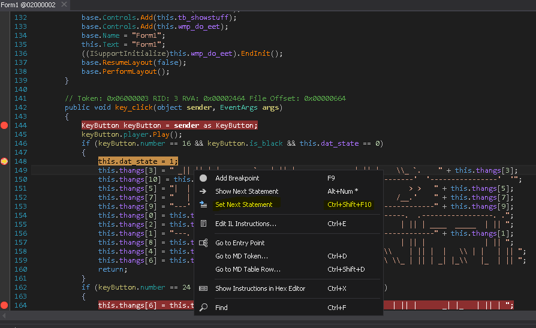
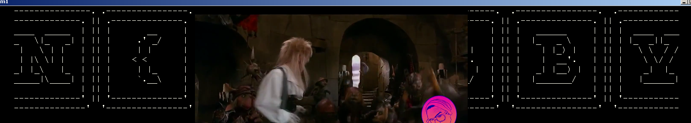

##Static analysis
This one is a .NET application ,i opened it in dnspy , it is not obfuscated .
It has few functions "Key_Click" in "Form1" class  is the function used as event handler for the keys ,set in the constructor of the class,.  
There are 8 if statements that must be satisfied in a specific order, luckliy the order is specified in the if condition (this.dat_state ).  
##Dynamic analysis
dnspy has the ability to set the current instruction (like modifying EIP register)  

so just set the make the program execute every if block from top to bottom and it will show the key   

PAN{B4BBY_Y3LL5_5O_LOUD!}

