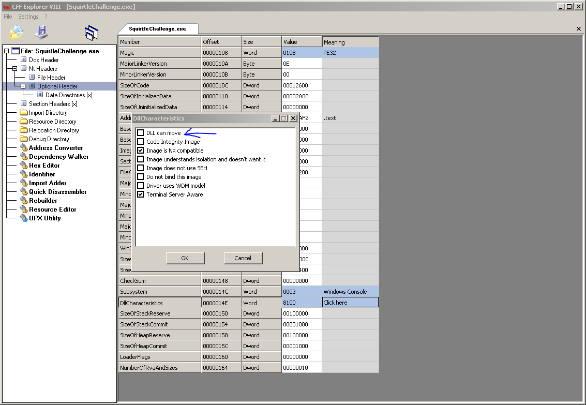

##Static analysis
Win32 native app, not packed, strings are not obfuscated imports CheckRemoteDebuggerPresent(),IsDebuggerPresent() 
The exe file supports ASLR -base address will change every run- to get the same addresses as mine you have to disable it 
  
There are some links in the strings ,they can help you understand the challenge.
##Dynamic/Code analysis
Function sub_401070 asks for a password, it then compares the user input against hardcoded string “incorrect”,that’s the password.  

The code will then check for various condition and displays a message that indicates whether the condition failed or not.
Change the destinatio of the branch if a badboy message appeared and you will solve it.

There is a call to sleep(1000) , bypass it or change the sleep duration to 1 ms or something ,so that the difference between the two calls to GetTickCount is not big.
Then this is the image   
PAN{Th3_$quirtL3_$qu@d_w@z_bLuffiNg}
