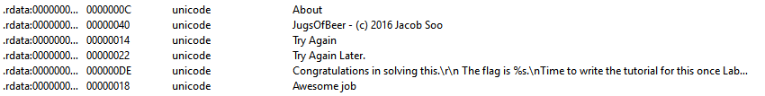
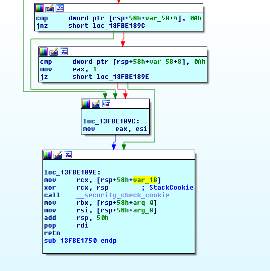
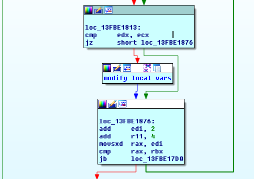

This file is x64 native app ,it has a text box and validate button.
The file is not packed and strings are not obfuscated , goodboy and badboy messages are plaintext in the file
  
Cross referencing the goodboy message leads to a function that has a call to GetDlgItemTextW, this is the function that will get the string from the text box
place a breakpoint at this point the buffer that receives the input will be at R8
at 0x000000013FBF1492 it checks that the length of the input is even and then at 0x000000013FBF14CA it checks that the length is at least 32 chars.  

At 0x000000013FBF1507 it checks that the input contains only {'1','2','3'} no other chars are allowed.  
Then a call to sub_13FBF1750 is made ,sub_13FBF1750 returns 1 if the serial is correct , 0 otherwise.
This function returns 1 when two local variables are equal to 10  
  
So we need to know does the serial manipulates these local vars.  

The validation code will take two chars from the serial i , i+1 **then increment i by 2 ** if they are equal then it will skip the code block that modifies the local vars
else it will modify them based of the value of the two chars.
  

So i wrote a script to brute force the correct serial using this pairs  ['1 2' , '1 3', '2 1' , '2 3', '3 1' ,'3 2'] 
duplicate numbers were removed because they won't change the state of local vars 

Bruteforcing the whole permutations is impossible  6 ** 16 is too big ,so i wrote a little script that just implements the validation algorithm and tried it manually for some time, then i discovered that some pairs will not change the local vars
for example the initial state of the local vars is : local_1 = 0 , local_2 = 13 , local_3=7 ,*local_3 is not checked but affects other vars*  
If the first two chars are 12 , 13 , 23 , 32 the values of the local vars will not change.
We can exclude the pairs that won't change the current state of local vars ,this leaves only two valid options for the first pair.  
other optimization is to exclude pairs that will revert the current state to an older state *this looping will increase the length of the serial and we don't want it here*

these two optimizations makes the brute forcing super fast .
```
__author__ = 'abd el rahman'

class state():
    parent = ''
    table = ''
    move = ''

    def __init__(self, table=[], move='', parent=[]):
        self.table = table
        self.move = move
        self.parent = parent


f = 0
s = 0
r10 = 0
table = []  # first element is to keep the 1 based index
states = [[[0, 0, 13, 7]]]
history = [[state([0, 0, 13, 7], '', [])]]
c = -1
pairs = ['1 2', '1 3', '2 1', '2 3', '3 1', '3 2']
while (c < 15):
    c += 1
    history.append([])
    states.append([])
    for i in history[c]: # for every current state in history[c] , try to add each pair of input , if it results in a new state , add it in history[c+1]
        table = list(i.table)
        curr_table = list(i.table)
        for j in pairs:
            bad = 0
            f, s = map(int, j.split())
            if s == 1:
                r10 = 19
            elif s == 2:
                r10 = 13
            else:
                r10 = 7
            fv = table[f]
            sv = table[s]
            summ = fv + sv
            if summ <= r10:
                table[s] = summ
                table[f] = 0
            else:
                table[s] = r10
                table[f] = summ - r10
            if table == curr_table:
                continue  # state didn't change
            else:
                for k in history:  # state is changed
                    for kk in k:
                        if table == kk.table:
                            bad = 1 # state is a duplicate
                            break
                if bad == 0:
                    history[-1].append(state(list(table), str(j), i.table))

                table = list(curr_table)

target = ''
for i in history:
    for j in i:
        if j.table[1] == 10 and j.table[2] == 10:
            target = j

moves = []
while target.table != [0, 0, 13, 7]:
    moves.append(target.move)
    for i in history:
        for j in i:
            if j.table == target.parent:
                target = j
print 'Serial'
print ''.join(moves[::-1]).replace(' ', '')

```
31211332133221321332133221321332
PAN{C0ngr47ulaT1ons_buddy_y0Uv3_solved_the_re4l_prObL3M}