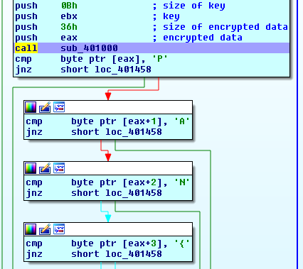

##Static analysis
This file has no strings , no imports and not packed.

##Dynamic/code analysis
The code starts like this   
  
It finds functions dynamically , the "key buffer" is filled with the output of some api calls ,
the code is designed for a specific operating system configuration.
By tracing the "key buffer" and reading the documentation of API functions i found the structure and the range of correct values for each field (bruteforcing 256**7 is too big  ).
```
+0 b    hardcoded
+1 0    hardcoded
+2 0    hardcoded
+3 !    hardcoded
+4 = 0x2d + curr month
+5 = 0x5e + curr day
+6 = 0x42 + curr hour
+7 = 0x3c + major version
+8 = 0x3f + minor version
+9 = 'i' or 'j'
+10 = 0x5e + language  
```
some values are hardcoded and the others change base on the system configuration


starting at 0x00401198 , there are alot of move instructions , and some garbage instructions between them
these movs construct the encrypted data buffer .

after building the encrypted buffer and the key buffer , there is a call to the decryption function.  


the decryption algorithms is RC4 https://en.wikipedia.org/wiki/RC4

The only missing thing is bruteforcing the missing parts of the key.
I had problems finding the correct language value 
GetUserDefaultUILanguage  returns "language identifier"
According to https://msdn.microsoft.com/en-us/library/windows/desktop/dd318691(v=vs.85).aspx  the language is:   
+-------------------------+-------------------------+
|     SubLanguage ID      |   Primary Language ID   |
+-------------------------+-------------------------+

https://msdn.microsoft.com/en-us/library/windows/desktop/dd318693(v=vs.85).aspx shows the possible "Prim. lang. identifier" and  "Sublang. identifier"
but the actual returned value is the value in the first column (locale id)  

This made me try more values for each missing character.  
```
__author__ = 'abd el rahman'
import multiprocessing
from ctypes import *
from Crypto.Cipher import ARC4

'''
+0 b    hardcoded
+1 0    hardcoded
+2 0    hardcoded
+3 !    hardcoded
+4 = 0x2d + curr month
+5 = 0x5e + curr day
+6 = 0x42 + curr hour
+7 = 0x3c + major version
+8 = 0x3f + minor version
+9 = 'i' or 'j'
+10 = 0x5e + language
'''
word = list('b00!_______')
major = range(0, 11)
major = [5]  # the correct value
minor = range(0, 11)
minor = [1]  # the correct value
curr_month = range(1, 13)
curr_month = [12]  # the correct value
curr_day = range(1, 32)
curr_day = [13]  # the correct value
curr_hour = range(0, 25)
curr_hour = [10]  # the correct value
dbg = [1]  # the correct value
languages = range(0, 10)
languages = [8]  # the correct value
second_table = [0xba, 0xaf, 0x4d, 0x55, 0x3c, 0xe3, 0x3, 0x22, 0xb0, 0xdf, 0xf3, 0xd3, 0x57, 0xd0, 0xe1, 0x40, 0xf9,
                0x13, 0x1f, 0xba, 0x8d, 0x12, 0xf1, 0xff, 0x48, 0xc2, 0x8e, 0x0, 0xfd, 0x54, 0x97, 0x9d, 0x75, 0x71,
                0x30, 0x8f, 0x43, 0x28, 0xfe, 0x69, 0x36, 0x47, 0x8f, 0xa2, 0xef, 0x49, 0x74, 0x7c, 0xe1, 0x4c, 0x6f,
                0x4f, 0xd4, 0x82]

for i in curr_month:
    word[4] = chr(0x2d + i)
    for j in curr_day:
        word[5] = chr(0x5e + j)
        for k in curr_hour:
            word[6] = chr(0x42 + k)
            for l in major:
                word[7] = chr(0x3c + l)
                for m in minor:
                    word[8] = chr(0x3f + m)
                    for n in dbg:
                        word[9] = chr(0x69 + n)
                        for o in languages:
                            word[10] = chr(0x5e + o)
                            print ''.join(word)
                            cipher = ARC4.new(''.join(word))
                            x = cipher.decrypt(''.join(map(chr, second_table)))
                            if x[0] == 'P' and x[1] == 'A' and x[2] =='N' and x[3] == '{':
                                print x

```  
PAN{th0se_puPP3ts_creeped_m3_out_and_I_h4d_NIGHTMARES}
