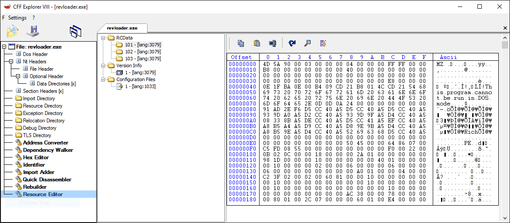
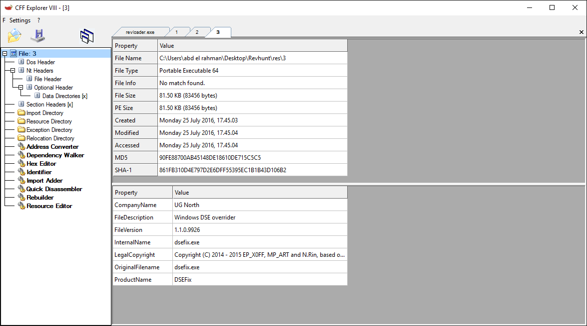
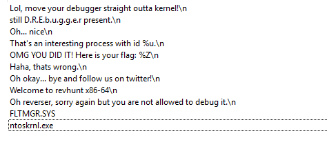
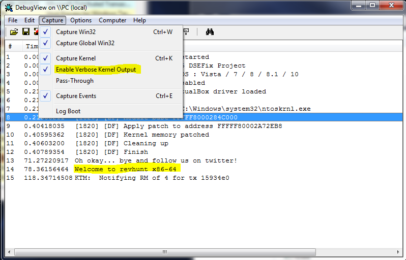
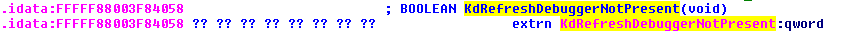
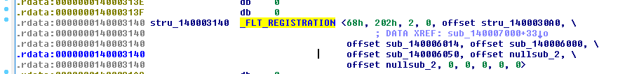

##Static analysis
The website said that this challenge has a kernel driver.  
The name of the file is loader so we probably dont care about it , only the loaded driver, so i opened it in CFF explorer and extracted the 3 files.  

* there are two PE64 files, one of them has some metadata that indicates that it Disables the driver signature enforcement protection  https://github.com/hfiref0x/DSEFix
  
so we wont analyze this PE file now.  
We are left with one PE64 and one text file , the PE64 is the driver that we will analyze and the text file is the ini file that installs the driver https://msdn.microsoft.com/en-us/windows/hardware/drivers/install/looking-at-an-inf-file  

From the ini file we can that the driver is a MiniFilter driver https://msdn.microsoft.com/en-us/windows/hardware/drivers/ifs/file-system-minifilter-drivers  
These are the strings in the driver 

##Dynamic/Code analysis
**IMAGE_BASE 0x140000000**

The DriverEntry function jumps to sub_140007000, which uses DbgPrint to print a string, so we will use DebugView from sysinternals
,I used Process hacker to control the installed service.
There are calls to KdDisableDebugger, so i patched it in memory with windbg (change the first byte of KdDisableDebugger to ret (0xc3) and nop the other bytes of the first instruction).

The driver also uses KdDebuggerNotPresent byte to detect the debugger, i patched this after being loaded into memory, i changed the address set by the loader at FFFFF88003F84058  at runtime so that this variable points to any other byte that is not zero ).

What we need now is to know what are the operations that this driver will intercept,and which functions will be called .These info are found in the second parameter sent to FltRegisterFilter. https://msdn.microsoft.com/en-us/library/windows/hardware/ff544305(v=vs.85).aspx  

To get these info may do it manually by reading msdn and , using ida pro staticaly , or using windbg dynamically .
We will use ida.
First load the fltmgr.pdb file into ida, i downloaded it using windbg https://msdn.microsoft.com/en-us/library/windows/desktop/ee416588(v=vs.85).aspx ,then from the local types window add _FLT_REGISTRATION,_FLT_OPERATION_REGISTRATION structs(I found them in the msdn documentation of FltRegisterFilter).
The second arg is at 0x140003140 , so undefine the data at that address and add struct _FLT_REGISTRATION.
The fifth argument is the OperationRegistration (from the documentation), ida should show the names of the fields but it doesn't for some reason, then define this argument as _FLT_OPERATION_REGISTRATION struct  

wdm.h header file contains the codes of IRP major functions,major function 0 is IRP_MJ_CREATE, which is called when a file/directory is being opened.The rest of the majorfunctions are handled by the same functions(1,4,0x13).  
 
The postoperation function sub_140001138 is more intersting than the preoperation function, it performs a byte by byte string comparison against '\grst.txt', probably thats name of the file, so lets start kernel debugging using windbg and virtualkd.  

at 00000001400011D6 it starts to check for a file named gsrt.txt, it then reads the content of the file and checks if it is "labyrenth.com", it then prints a dummy flag PAN{0h_my,_you_think_its_that_easy?} .Then at 0000000140001437  is starts to check if the file name is "pan.flag", it then passes it to Function sub_14000181C which reads the content of file "pan.flag" and performs simple arithmetic/bitwise operations to verfiy it .
the content of "pan.flag must" be PAN{Wow, reverser! Great moves, keep it up, proud of you!}.
The two files must be present with the correct contents, i placed them in c:/ and opening it in the explorer triggers the postoperation function.

