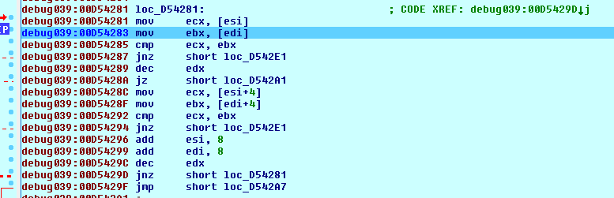
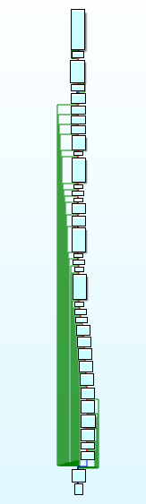

##Static analysis
The executable is packed,no strings no imported functions and no crypto signatures.

Dynamic analysis
I tried multiple things to solve this challenge :
i tried setting break points at USER32.RegisterClass function, the argument of this function has field lpfnWndProc, which is the user function that will be called when a event is triggered , like pressing the Enter button.
Then find out how the input is handled, but there were too many function calls, so i tried something else.

Using process explorer, i tried searching for the string "Wrong" that is written as the Result,and i found it plaintext in the memory image.  
![1.png]  
##Dynamic analysis
Then i searched for the string in IDA Pro "search->Find sequence of bytes-> Find "Wrong" ,But first pause the program so that the debugger refreshes its memory , there are two results, one in the .text section (ignore it) , and the other in .debug section (place a Read Hardware Breakpoint at this occurence)  

  
**Note: IDA didn't show the bytes as a string, you have to undefine the bytes first and then define them as ascii string.  

The breakpoint will hit inside a function  

   
From the call stack find the caller of this function.    
  
The highligthed byte at the bottom controls the success message, so place Write hardware breakpoint at it and click enter in the gui , and u will land inside the function that verifies the entered serial,it contains several simple bitwise/arithmetic operations performed on each letter in the input,reverse them and you will get the flag.  

  
I then faced two minor problems:
- reversing some operations will give multiple answers, so i chose the letter that fits in the current word.  
- one char was corrupted, maybe i courrupted some data, so i guessed it and verfied my guess in the GUI without debugger.  

PAN{d3lphi_is_e4sy_t0_rev3rSE}
